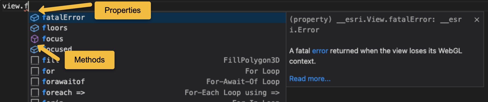

# ArcGIS API for JavaScript 4.x starter apps

The goal of these starter apps is to **provide the best developer experience** possible for developers learning the [ArcGIS API for JavaScript](http://js.arcgis.com/) 

|Language|Framework|From|Strategy|Bundler|Code|
|---|---|---|---|---|---|
|JavaScript|None|CDN|AMD|None|[Code](./js-amd-cdn-nobundler-noframework)
|JavaScript|Svelte|CDN|AMD|Rollup.js|[Code](./js-amd-cdn-rollup-svelte)
|JavaScript|None|CDN|ESM|None|[Code](./js-esm-cdn-nobundler-noframework)
|JavaScript|Ember.js|Local|ESM|None|[Code](./js-esm-local-nobundler-ember)
|JavaScript|React|Local|ESM|None|[Code](./js-esm-local-nobundler-react)
|JavaScript|Vue.js|Local|ESM|None|[Code](./js-esm-local-nobundler-vue)
|JavaScript|None|Local|ESM|Rollup.js|[Code](./js-esm-local-rollup-noframework)
|JS / NodeJS|None|Local|ESM|Rollup.js|[Code](./js-esm-local-rollup-nodejs)
|JavaScript|None|Local|ESM|Snowpack|[Code](./js-esm-local-snowpack-noframework)
|JavaScript|None|Local|ESM|Vite|[Code](./js-esm-local-vite-noframework)
|JavaScript|None|Local|ESM|Webpack|[Code](./js-esm-local-webpack-noframework)
|JavaScript|None|Local|ESM|Webpack|[Code (alt)](./js-esm-local-webpack-noframework-2)
|TypeScript|None|CDN|AMD1|None|[Code](./ts-amd-cdn-nobundler-noframework)
|TypeScript|Angular|Local|ESM|None|[Code](./ts-esm-local-nobundler-angular)
|TypeScript|None|Local|ESM|Rollup.js|[Code](./ts-esm-local-rollup-noframework)
|TypeScript|None|Local|ESM|Webpack|[Code](./ts-esm-local-webpack-noframework)

Recomemded talks: 

* [ArcGIS API for JavaScript: Options for Consuming the API](https://www.youtube.com/watch?v=UL0m0EXW8Es)
* [ArcGIS API for JavaScript: Building Apps with ES Modules](https://www.youtube.com/watch?v=ojrGonjJI2k)

## Code autocompletion 

You can speed up your developement using code autocompletion in any application that uses local ESM modules (with plain JS) or TypeScript within [Visual Studio Code](https://code.visualstudio.com/download) because both includes **[@types/arcgis-js-api](https://www.npmjs.com/package/@types/arcgis-js-api)** and the IDE identifies it an extend the autocompletion.

With type definitions you will get

1) Autocompletion of supported properties and methods of each class: 

2) Documentation about supported parameters, links to the API Reference, etc.: 

# Code snippets

You can speed up your developement using code using **[ArcGIS API for JavaScript Snippets for Visual Studio Code](https://marketplace.visualstudio.com/items?itemName=Esri.arcgis-jsapi-snippets)**. It includes **code snippets** to:

1) Help you instantiate classes like `Webmap`: 

2) Providing you with all accepted values in a property like `map.basemap`: 
 

3) But you can also **[add your own code snippets](https://github.com/Esri/arcgis-js-vscode-snippets/blob/master/contributing.md#contributing-guidelines)**

You can find additional snippets in [https://github.com/hhkaos/esri-vscode-snippets](https://github.com/hhkaos/esri-vscode-snippets) and a [snippets builder tool](https://hhkaos.github.io/vscode-snippets-builder/) to add your custom ones.

You can also migrate those [snippets to Sublime Text and Atom with this tool](https://snippet-generator.app/?description=&tabtrigger=&snippet=&mode=sublimetext).

## Contributions

New starter apps and improvements to existing starter apps (simplifications, instructions, bug fixing, updates, ...) are welcome. So please feel free to submit yours.

If you don't find a starter app that fits your needs, do not hesitate and [open an issue](https://github.com/hhkaos/arcgis-js-api-starter-apps/issues).

> **Note 1**: you will use `import` statements (ESM) with the AMD path, and the TypeScript compiler will translate them to AMD.

## Starter apps maintenance and support

This starter apps are maintained by the community. If you find something broken or outdated and **the code from the starter app comes from another repository please open the issue there**, if it doesn't feel free to [open an issue on this repo](https://github.com/hhkaos/arcgis-js-api-starter-apps/issues).

Note that frameworks and bundlers are outside of the [scope of support](https://support.esri.com/en/supportscope) from the Esri Technical Support. In any case, you can use the issues repositories related to each starter app to interact with the community for support.

## Acknowledgments

Bellow you will find some of the resources used to compile this samples apps:

* [https://github.com/Esri/jsapi-resources/tree/master/esm-samples/*](https://github.com/Esri/jsapi-resources/tree/master/esm-samples): ts-esm-local-nobundler-angular, js-esm-local-nobundler-ember, js-esm-local-nobundler-react, js-esm-cdn-nobundler-noframework, js-esm-local-rollup-nodejs, js-esm-local-nobundler-vue, js-esm-local-webpack-noframework-2, js-esm-local-rollup-noframework
* [https://github.com/Esri/arcgis-js-cli](https://github.com/Esri/arcgis-js-cli): ts-esm-local-rollup-noframework, ts-esm-local-webpack-noframework
* [https://github.com/Esri/jsapi-resources/tree/master/4.x/typescript/demo](https://github.com/Esri/jsapi-resources/tree/master/4.x/typescript/demo): ts-amd-cdn-nobundler-noframework
* [http://js.arcgis.com/](http://js.arcgis.com/): js-amd-cdn-nobundler-noframework
* [Quick look at custom builds with ArcGIS JSAPI](https://www.youtube.com/watch?v=VmzjaGfBRyo): js-esm-local-vite-noframework, js-esm-local-webpack-noframework
* [https://github.com/odoe/snowpack-jsapi](https://github.com/odoe/snowpack-jsapi): js-esm-local-snowpack-noframework