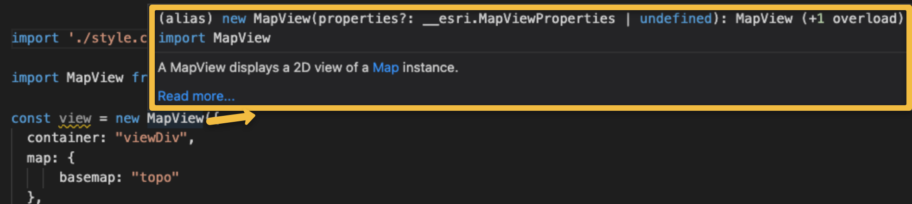
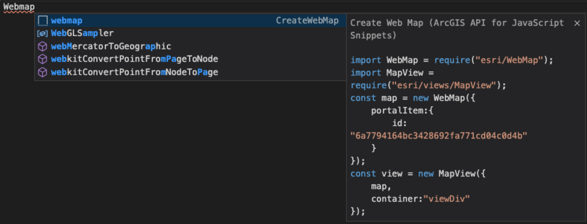
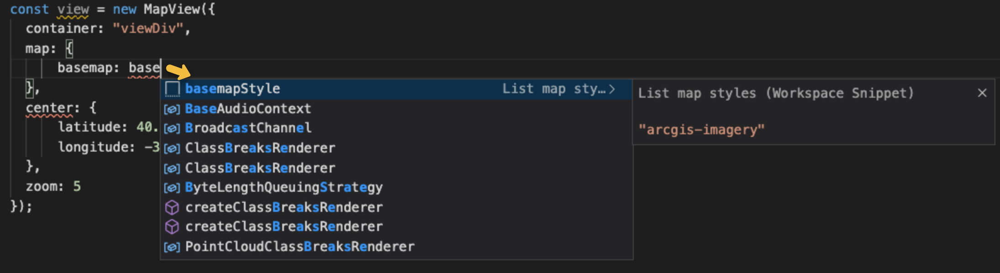
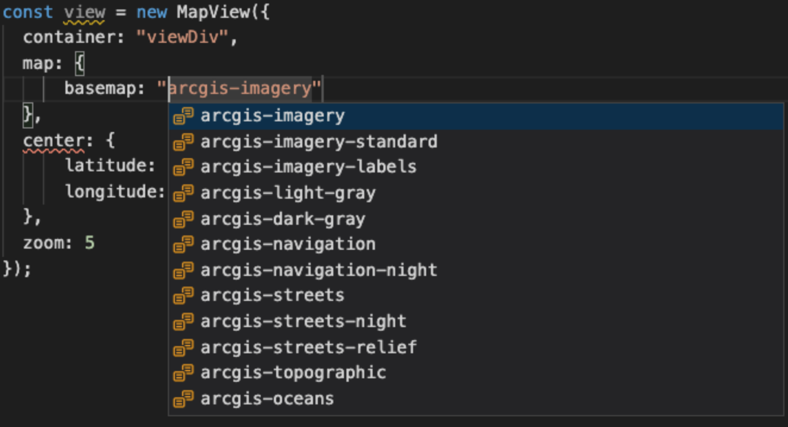

> Original code from: [github.com/Esri/jsapi-resources](https://github.com/Esri/jsapi-resources/tree/master/4.x/typescript/demo)

# Getting started - ArcGIS API for JavaScript

The goal of this project is to **provide the best developer experience** possible for developers learning the [ArcGIS API for JavaScript](http://js.arcgis.com/) **using VS Code properly configured to enjoy from code autocompletion and code snippets**.

<!-- START doctoc generated TOC please keep comment here to allow auto update -->
<!-- DON'T EDIT THIS SECTION, INSTEAD RE-RUN doctoc TO UPDATE -->
**Table of Contents**  

- [IDE setup to speed-up your development](#ide-setup-to-speed-up-your-development)
- [Requirements](#requirements)
- [Documentation, videos and tutorials](#documentation-videos-and-tutorials)
  - [Learning paths](#learning-paths)

<!-- END doctoc generated TOC please keep comment here to allow auto update -->

---

## IDE setup to speed-up your development

You will neet use [Visual Studio Code](https://code.visualstudio.com/download) to speed up your developement by using type definitions and code snippets. 

* Using **ESM and type definitions** (**[@types/arcgis-js-api](https://www.npmjs.com/package/@types/arcgis-js-api)**) you will benefit from:
    1) Autocompletion of supported properties and methods of each class: 
    
    
    2) Documentation about supported parameters, links to the API Reference, etc.: 
    
* Using **[ArcGIS API for JavaScript Snippets](https://marketplace.visualstudio.com/items?itemName=Esri.arcgis-jsapi-snippets)**. It includes **code snippets** to:
    1) Help you instantiate classes like `Webmap`: 
    

    2) Providing you with all accepted values in a property like `map.basemap`: 
     

    3) But you can also **[add your own code snippets](https://github.com/Esri/arcgis-js-vscode-snippets/blob/master/contributing.md#contributing-guidelines)**

## Requirements

You will need to have NodeJS, [Visual Studio Code](https://code.visualstudio.com/download) and the [ArcGIS API for JavaScript Snippets](https://marketplace.visualstudio.com/items?itemName=Esri.arcgis-jsapi-snippets) previously installed.

## Development

* First time install the dependencies running: `npm run install`.
* Run the development environment: `npm run dev`.
* Open [index.html](index.html) - **recomendation**: use [Live Server extension](https://marketplace.visualstudio.com/items?itemName=ritwickdey.LiveServer).
* Edit [app/main.ts](app/main.ts) and enjoy the IntelliSense & code snippets.

## Documentation, videos and tutorials

To better understand the code of the `index.html`, `app/main.ts` and `tsconfig.json` files read this page [TypeScript - Setting up your development environment](https://developers.arcgis.com/javascript/latest/typescript-setup/).

As you can notice, you will be editing a file which uses the Typescript extension (`app/main.ts`), so you **need to have a basic understanding on how to use TypeScript**. That's why we have make this **[Getting started with TypeScript and ArcGIS JS API](./docs/README.md)**.

To get a global overview on what can be done with the API we recommend you to read the [Mapping APIs and services guide](https://developers.arcgis.com/documentation/mapping-apis-and-services/maps/) and do the tutorials.

If you prefer videos, you can find all a [curated playlist of videos about the JavaScript API for ArcGIS](https://gist.github.com/hhkaos/0990fe034fc37c800206964f23e6f9e4#file-readme-md) at the [Esri Developer Summit](https://www.esri.com/en-us/about/events/devsummit/save-date) 2021.

### Learning paths

We are still working on selecting a curated list of resources you help you better understand which are the most important lessons to get your goal.

But if you need advise do not hesitate, [open an issue](https://github.com/hhkaos/arcgis-jsapi-getting-started/issues).